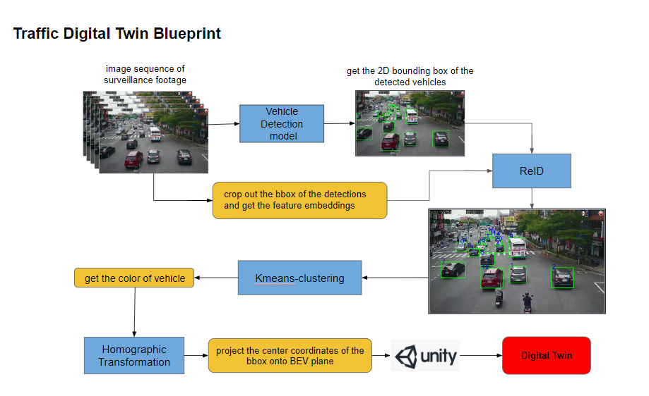

#traffic digital Twin
Developed a system capable of detecting the driver’s eyes and mouth to determine the driver’s sobriety status.

## Demo



## Run

1. Run `infer_reid_vehicle.py`.
```
python infer_reid_vehicle.py --dets dets/taiwan 
```
2. Run `Run.py`
```
python Run.py
```
